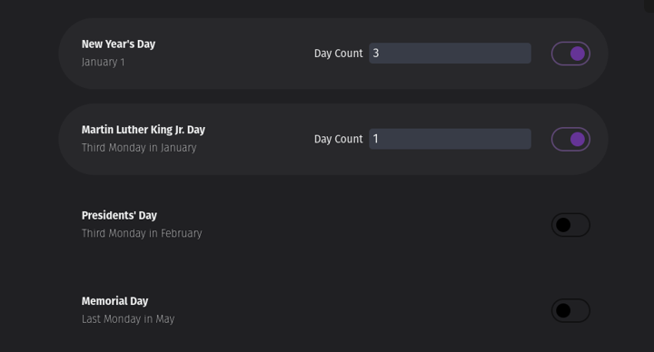

# Calculates the total days need for a school year

Solving a need for my wife that had to calculate the days required for a school year.

## User Stories

### Observing US National Holidays

-   User is able to select what US national holiday to observe, once the holiday is selected then user is able to choose how many days for that particular event.

-   User will be able to the total amount of days at the top of the section

-   User should see at the top, the national holidays that fall with in the school year, or have a checkbox to show the holiday for the full year. By default have holiday

-   Once set then will persist the user selection

-   Placed in the settings area since user should not need to touch it very often once the

#### UI-v1

## Future

-   convert to sveltekit w/ typescript
